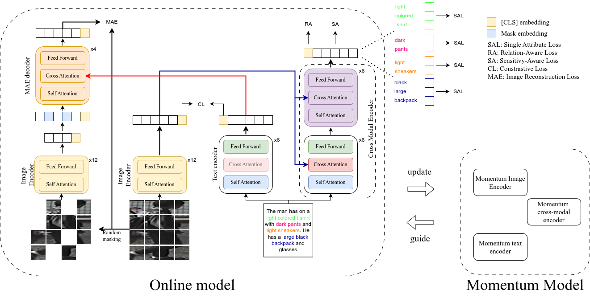

# MARS: Paying more attention to visual attributes for text-based person search

This is the official PyTorch implementation of the paper [MARS: Paying more attention to visual attributes for text-based person search](). 
This repository supports training and evaluation on three text-based person search benchmarks: CUHK-PEDES, ICFG-PEDES and RSTPReid.



## Usage
### Enviroment preparation
```bash
conda create -n MARS python==3.9
conda activate MARS

pip3 install torch torchvision torchaudio
pip install transformers==4.8.1
pip install timm==0.4.9
pip install spacy
python -m spacy download en
pip install einops
conda install anaconda::ruamel_yaml
pip install matplotlib
```

### Prepare Datasets

For datasets preparation and download, please refer to [RaSA](https://github.com/Flame-Chasers/RaSa/).

### Pretrained Checkpoint
- Please download the [pretrained ALBEF Checkpoint](https://storage.googleapis.com/sfr-pcl-data-research/ALBEF/ALBEF.pth).

### Training
Inside the shell folder there are the script for each training.

To train our model just choose a dataset and do:
```shell
# 1. Training on CUHK-PEDES
bash shell/cuhk_train.sh

# 2. Training on ICFG-PEDES
bash shell/icfg_train.sh

# 3. Training on RSTPReid
bash shell/rstp_train.sh
```

Before training, please update dataset location inside each ```.yaml``` file.


### Testing

Inside the shell folder there are the script to test each model.

```shell
# 1. Testing on CUHK-PEDES
bash shell/cuhk-eval.sh

# 2. Testing on ICFG-PEDES
bash shell/icfg-eval.sh

# 3. Testing on RSTPReid
bash shell/rstp-eval.sh
```

Before testing, please update the checkpoint location inside each ```.sh``` file.

## MARS Performance on Three Text-based Person Search Benchmarks
### CUHK-PEDES dataset

|     Method      |  Rank-1   |  Rank-5   |  Rank-10  |    mAP    |
| :-------------: | :-------: | :-------: | :-------: | :-------: |
|     CMPM/C      |   49.37   |   71.69   |   79.27   |     -     |
|      ViTAA      |   55.97   |   75.84   |   83.52   |     -     |
|      DSSL       |   59.98   |   80.41   |   87.56   |     -     |
|       SAF       |   64.13   |   82.62   |   88.40   |   58.61   |
|      LGUR       |   65.25   |   83.12   |   89.00   |     -     |
|       IVT       |   65.59   |   83.11   |   89.21   |     -     |
|      CFine      |   69.57   |   85.93   |   91.15   |     -     |
|      ALBEF      |   60.28   |   79.52   |   86.34   |   56.67   |
|    **RaSa**     |   76.51   |   90.29   |   94.25   |   69.38   |
| **MARS (ours)** | **77.62** | **90.63** | **94.27** | **71.41** |

[Model for CUHK-PEDES](https://univpr-my.sharepoint.com/:u:/g/personal/alex_ergasti_unipr_it/Eb6kU2z0UXFCqPUkJay4SdEBr958rd0sO8n1SX8MaILCeA?e=6dOApg)

### ICFG-PEDES dataset

|     Method      |  Rank-1   |  Rank-5   |  Rank-10  |    mAP    |
| :-------------: | :-------: | :-------: | :-------: | :-------: |
|     CMPM/C      |   43.51   |   65.44   |   74.26   |     -     |
|      SSAN       |   54.23   |   72.63   |   79.53   |     -     |
|       SAF       |   54.86   |   72.13   |   79.13   |   32.76   |
|       IVT       |   56.04   |   73.60   |   80.22   |     -     |
|      CFine      |   60.83   |   76.55   |   82.42   |     -     |
|      ALBEF      |   34.46   |   52.32   |   60.40   |   19.62   |
|    **RaSa**     |   65.28   |   80.40   |   85.12   |   41.29   |
| **MARS (ours)** | **67.60** | **81.47** | **85.79** | **44.93** |

[Model for ICFG-PEDES](https://univpr-my.sharepoint.com/:u:/g/personal/alex_ergasti_unipr_it/EdSC52AI76VEiAcQzD92HNcBPCxSutaW0HuwkglImhi5gA?e=ERW1XO)

### RSTPReid dataset

|     Method      |  Rank-1   |  Rank-5   |  Rank-10  |    mAP    |
| :-------------: | :-------: | :-------: | :-------: | :-------: |
|      DSSL       |   32.43   |   55.08   |   63.19   |     -     |
|      SSAN       |   43.50   |   67.80   |   77.15   |     -     |
|       SAF       |   44.05   |   67.30   |   76.25   |   36.81   |
|       IVT       |   46.70   |   70.00   |   78.80   |     -     |
|      CFine      |   50.55   |   72.50   |   81.60   |     -     |
|      ALBEF      |   50.10   |   73.70   |   82.10   |   41.73   |
|    **RaSa**     |   66.90   |   86.50   | **91.35** |   52.31   |
| **MARS (ours)** | **67.55** | **86.55** | **91.35** | **52.92** |

[Model for RSTPReid](https://univpr-my.sharepoint.com/:u:/g/personal/alex_ergasti_unipr_it/EddGS5Y5Io5HmPZFkw3HnAsBbstGUFi7xaqTMQhpLDcNmA?e=3kZeSG)

### Ablation study

#### Gradcam


Visual comparison of cross attention maps generated by the baseline model (top) and our model (bottom) using Grad-CAM. The attention maps illustrate the cross-modal encoder focus on different regions corresponding to individual words in the attribute chunks. The proposed attribute loss leads to more consistent and accurate attention distribution across words.


#### Top 10 rank


Overview of comparison between top 10 predictions of baseline and our model. Predicted images are ranked from left (i.e., position 1) to the right (i.e., position 10). Our model outperforms the baseline in several pairs, i.e., **a,b,c,d**. In pair **c** it is possible to observe how all predictions are with a bike in it, while this is not true in the baseline. Furthermore, even if in pair **e** our model does not predict the second position correctly, it is easy to observe how a higher mAP is achieve by providing 3 correct matches in top 10 positions compared to 2 correct matches in top 10 of the baseline. Lastly, in pair **f** our model is not able to predict any correct image due to the vagueness of the caption, but is still retrieving images closely related to the text.


## Acknowledgments
The implementation of MARS relies on resources from [RaSA](https://github.com/Flame-Chasers/RaSa/), [Huggingface Transformers](https://github.com/huggingface/transformers), and [timm](https://github.com/rwightman/pytorch-image-models/tree/master/timm). We sincerely appreciate the original authors for their open-sourcing.


## Citation
If you find this code useful for your research, please cite our paper.

```tex
@misc{ergasti2024marspayingattentionvisual,
      title={MARS: Paying more attention to visual attributes for text-based person search}, 
      author={Alex Ergasti and Tomaso Fontanini and Claudio Ferrari and Massimo Bertozzi and Andrea Prati},
      year={2024},
      eprint={2407.04287},
      archivePrefix={arXiv},
      primaryClass={cs.CV},
      url={https://arxiv.org/abs/2407.04287}, 
}
```
